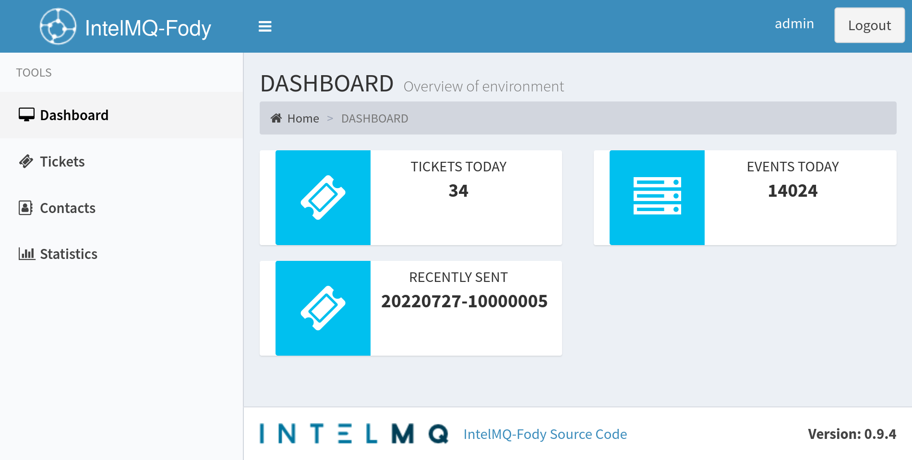
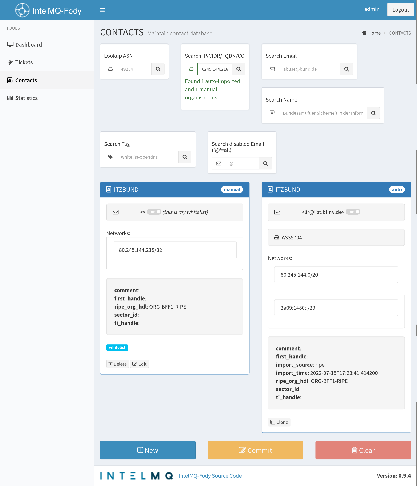
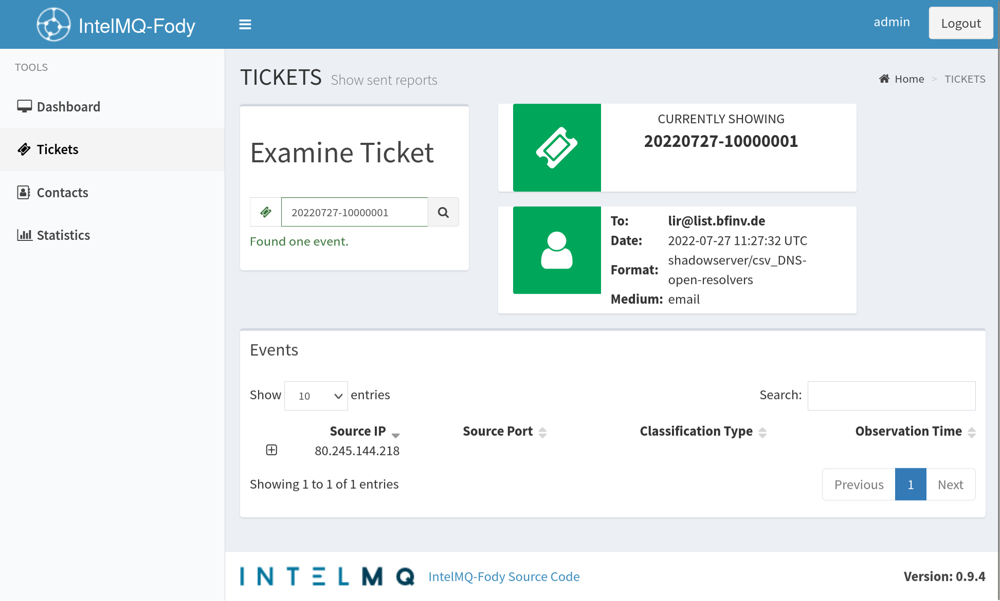
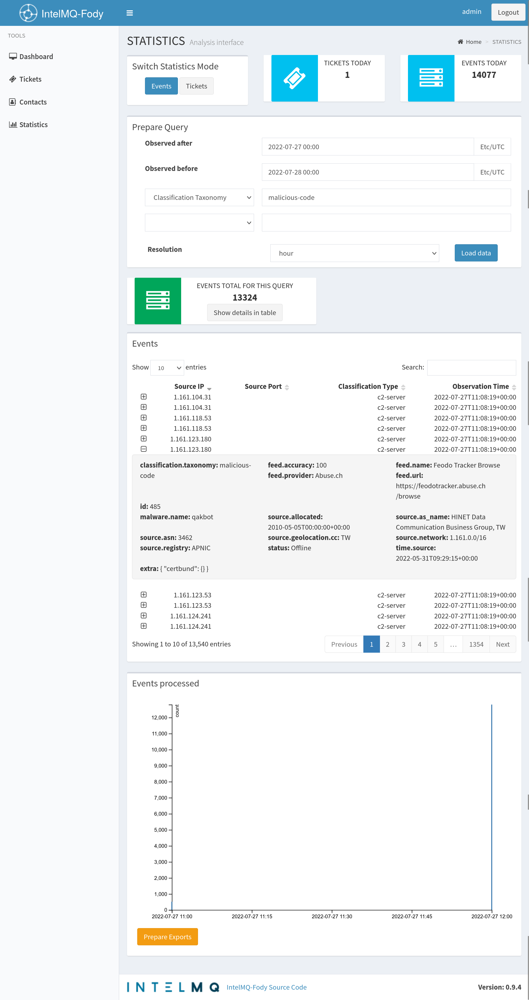

**Fody** is an interface for
[IntelMQ-CB-Mailgen](https://github.com/Intevation/intelmq-mailgen-release) setups.



### Features
 * Shows event details for a report that has been send out.
 * Inspect and edit [IntelMQ certbund-contact](https://github.com/Intevation/intelmq/tree/certbund-contact/intelmq/bots/experts/certbund_contact) database.
 * Overview charts that can be exported as SVG or CSV.


Installation
------------

#### Download:

Download (or clone) the source code.

[Install yarn v1 "globally"](https://classic.yarnpkg.com/en/docs/install).


#### Build Setup

``` bash
# install dependencies
yarn

# serve with hot reload at localhost:8080
#   and proxy /api requests to localhost:8002
yarn run dev

# build for production with minification
yarn run build
```


For data to be retrieved, you need to have http(s) access to the
[intelmq-fody-backend](https://github.com/Intevation/intelmq-fody-backend).

See the [setup example for Ubuntu](docs/SetupExampleUbuntu.md) for a complete example.

Documentation
-------------

Check the [NEWS](NEWS.md) when upgrading from a previous version.

Some [design considerations](docs/DesignConsiderations.md) are documented.

The layout frame has originally been derived from the [CoPilot](https://github.com/misterGF/CoPilot) template.

Screenshots
-----------







License
-------
Fody is Free Software under the licenses of CoPilot,
the included components and
GNU Affero GPL v>=3 (for the files originating here).
Please see particular source files for details.

During the build process a number of Free Software tools and components
are used, parts of them are included in the production build.
To get an overview of the licenses of the dependencies:
```sh
yarn licenses ls | grep License: | sed 's/^.*License: /License: /' | sort -u
```
While `yarn licenses ls` and `yarn generate-disclaimer` will give you
more details.

CoPilot is a Free Software initiative by [Gil Ferreira](http://gferreira.me)
and licensed under [MIT](http://opensource.org/licenses/MIT).

CoPilot is based on the [AdminLTE](https://github.com/almasaeed2010/AdminLTE)
template.

Tests
-----

```bash
npm npm i -D karma-webpack  # or
yarn yarn add -D karma-webpack

npm run test
```

Credits
-------
Exclusive usage rights: German Federal Office for Information Security (BSI).

Software-Engineering by Intevation.

Logo by Marcel "Howly" Newman
